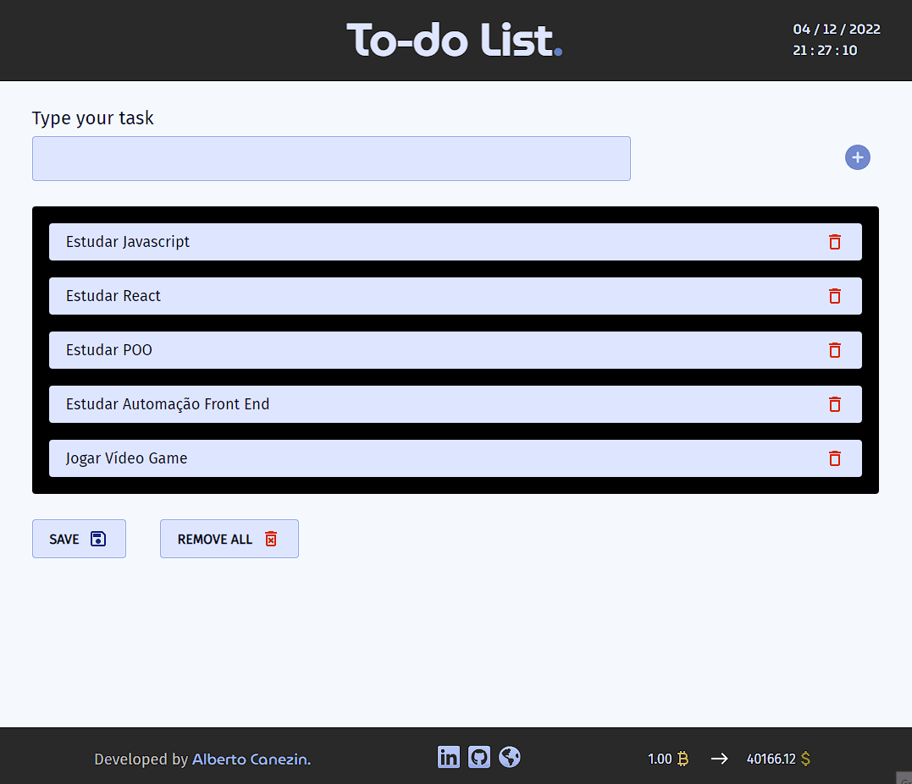

# Todo-List

<p style="font-size: 16px;">Todo-list é um projéto pessoal desenvolvido para pratiar JavaScript, foi desenvolvido sem usar nenhum plugin, ou ferramenta externa, tudo foi desenvolvido do zero. <br>
Este projeto usou como metodologia POO, orientação a objeto.</p>

- Foi desenvolvido com boas práticas em JavaScript
- É totalmente responsivo
- Foi utilizado classes com JavaScript

## Técnologias Utilizadas

- JavaScript ES6+
- CSS3 - FlexBox - CSS Grid
- HTML5

## Visual Todo-list

<p>Tela Desktop</p>


<hr>

<p>Tela Mobile</p>


<hr>

<p>Adicionando uma tarefa</p>


<hr>

<p>Salvar a lista no local storage</p>


<hr>

<p>Organizar a lista com Drag in Drop</p>


<hr>

<p>Remover item da lista</p>


<hr>

<p>Remover a lista completa</p>


<hr>

## Visualize todo o projeto em

<a href="https://canezinbeto.github.io/to-do-list/" target="_blank">https://canezinbeto.github.io/to-do-list/</a>

## Para testar na sua máquina

<p>Pré-requisitos</p>
<p>Você precisa ter instalado na sua máquina as ferramentas: <a href="https://git-scm.com/">Git</a>, <a href="https://nodejs.org/en/">Node.js</a> e também <a href="https://code.visualstudio.com/">Vscode</a> com a extensão liveServer</p>

```bash
# Basta clonar o repositório em sua máquina
$ git clone https://github.com/CanezinBeto/to-do-list.git

# Abrir com o Vscode e visualizar com o liveServer
```

Desenvolvido por Alberto Canezin :rocket: [veja meu LinkeIn](https://www.linkedin.com/in/albertocanezin-dev/)
